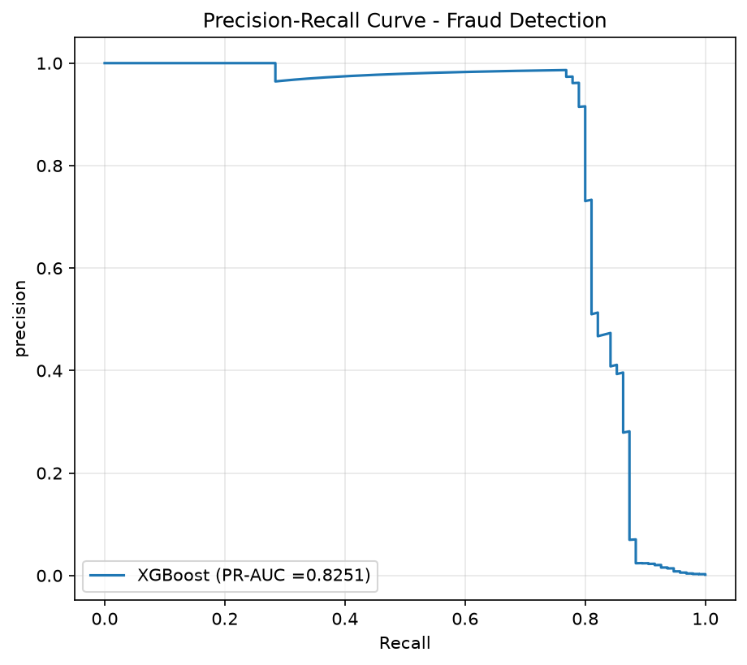
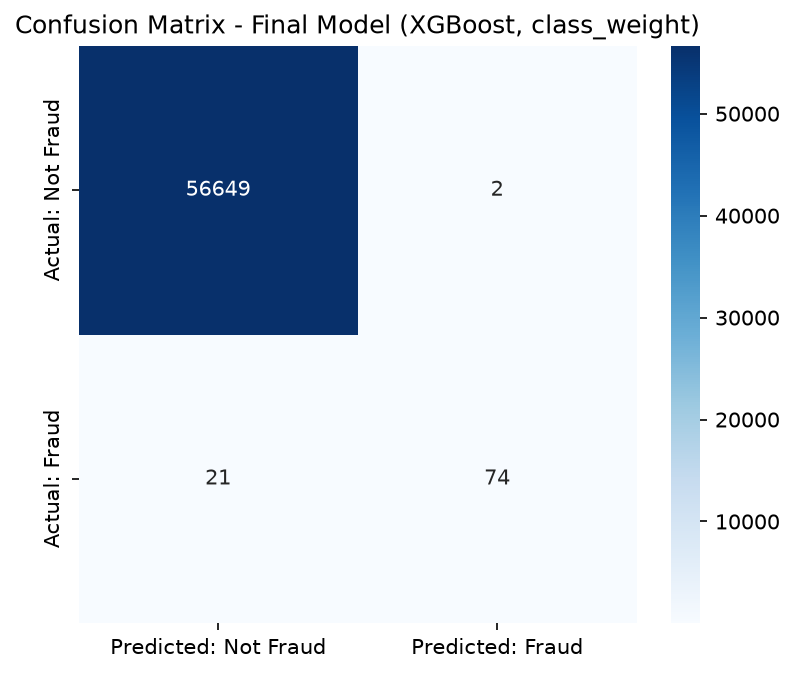

# Credit Card Fraud Detection

A machine learning project that detects fraudulent credit card transactions. The dataset is highly imbalanced — only 0.17% of transactions are fraud — so most of this project is about handling that imbalance correctly and picking the right way to measure success, not just training a model. Includes a working prediction API built with FastAPI.

## The Problem

Only 473 out of 283,726 transactions in this dataset are fraud. That means a model that just guesses "not fraud" every single time would be 99.83% accurate — while catching zero fraud. So accuracy is a bad way to judge this model. This project focuses on precision, recall, and PR-AUC instead, and explains why at each step.

## Dataset

- Source: [Credit Card Fraud Detection dataset on Kaggle](https://www.kaggle.com/datasets/mlg-ulb/creditcardfraud)
- 284,807 transactions, with features `Time`, `V1`–`V28` (already anonymized/transformed), `Amount`, and `Class` (0 = legit, 1 = fraud)
- Removed 1,081 exact duplicate rows before doing anything else, since keeping them could let the same transaction show up in both training and testing
- After cleanup: 283,726 rows, 473 fraud cases (0.166%)

*The raw CSV isn't included in this repo because it's large. Download it from the Kaggle link above and place it in `data/creditcard.csv` to run this yourself.*

## How I Built It

1. **Cleaned the data** — removed duplicates first, before splitting anything.
2. **Split into train/test (80/20)**, making sure both sets kept the same fraud ratio.
3. **Scaled the numeric features** (`Time`, `Amount`) — but only using the training set's stats, then applied that same scaling to the test set. Scaling before splitting would let test data leak information into training.
4. **Tried two ways to deal with the imbalance:**
   - `class_weight='balanced'` — just tells the model to pay more attention to fraud cases while training, without changing the data
   - **SMOTE** — creates new, synthetic fraud examples to balance the training data
5. **Trained 3 models** (Logistic Regression, Random Forest, XGBoost) with both approaches — 6 models total.
6. **Measured performance with precision, recall, F1, and PR-AUC** instead of accuracy, since accuracy is misleading here.
7. **Tuned the best model** using `RandomizedSearchCV`, then checked whether tuning actually helped.
8. **Wrapped the final model in a FastAPI endpoint** so it can be used for real-time predictions.

## Results

| Model | Precision | Recall | F1 | PR-AUC |
|---|---|---|---|---|
| Logistic Regression (class_weight) | 0.056 | 0.874 | 0.106 | 0.672 |
| Random Forest (class_weight) | 0.958 | 0.726 | 0.826 | 0.803 |
| **XGBoost (class_weight)** | **0.974** | **0.779** | **0.865** | **0.825** |
| Logistic Regression (SMOTE) | 0.053 | 0.874 | 0.100 | 0.677 |
| Random Forest (SMOTE) | 0.923 | 0.758 | 0.832 | 0.798 |
| XGBoost (SMOTE) | 0.721 | 0.789 | 0.754 | 0.812 |
| XGBoost (tuned) | 0.925 | 0.779 | 0.846 | 0.826 |

**Final model: XGBoost with `class_weight` handling, untuned.**




### Why SMOTE didn't help

I expected SMOTE to improve things, but it didn't — for XGBoost, it actually made precision much worse (0.974 → 0.721) while barely improving recall. My best explanation: there are only 378 real fraud examples spread across 28 features, so they're spread thin. SMOTE creates new fraud examples by drawing points "between" existing ones — but when the real examples are spread out like this, those in-between points can land in places that don't really look like real fraud. Training on that adds noise instead of useful signal.

### Why I didn't use the tuned model

Hyperparameter tuning barely improved PR-AUC (a 0.001 difference — basically nothing) but at the actual decision point the model uses to say "fraud" or "not fraud," it tripled the number of false alarms. PR-AUC looks at performance across many possible thresholds, but the model only really uses one threshold when making a prediction. A tiny gain across many thresholds doesn't mean anything got better at the one threshold that's actually used — so I kept the simpler, untuned model instead.

## Why I Built This

*(write 2-4 sentences here, in your own words — the "annoyed by black-box fraud detection in banking apps" idea we talked through)*

## Limitations & What I'd Do Differently

*(write 2-4 sentences here — mention the PCA-anonymized features limiting real feature engineering, and the idea of testing with a time-based split instead of a random one)*

## How to Run This

```bash
# 1. Clone the repo and set up a virtual environment
git clone <your-repo-url>
cd fraud-detection
python -m venv venv
venv\Scripts\activate        # Windows
source venv/bin/activate     # Mac/Linux

# 2. Install dependencies
pip install -r requirements.txt

# 3. Download creditcard.csv from Kaggle and place it in data/

# 4. Run the pipeline
python src/data_prep.py
python src/train.py
python src/evaluate.py

# 5. Start the API
uvicorn api.main:app --reload
# then visit http://127.0.0.1:8000/docs
```

## Tech Stack

Python, scikit-learn, XGBoost, imbalanced-learn, Pandas, NumPy, FastAPI, Matplotlib/Seaborn